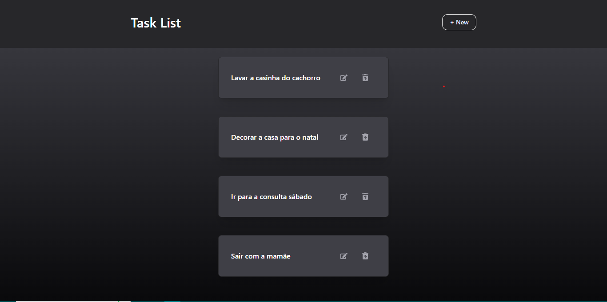
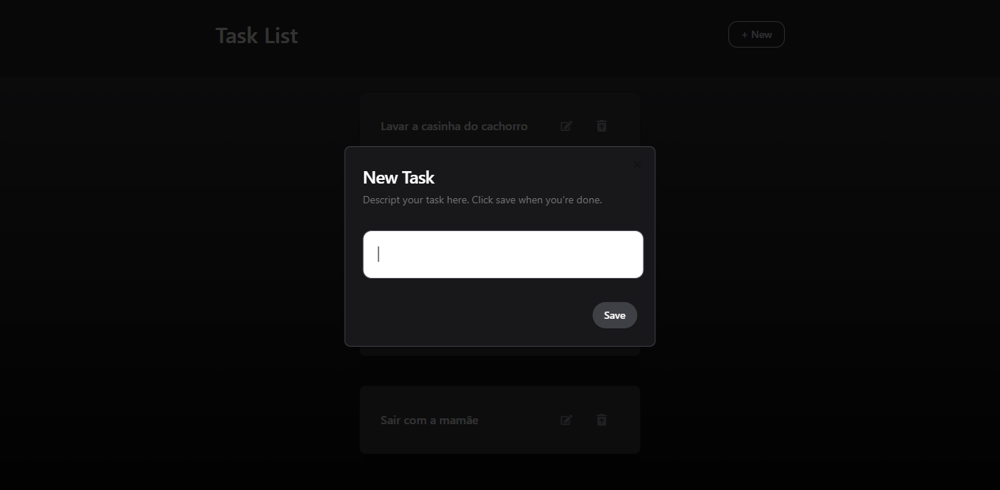
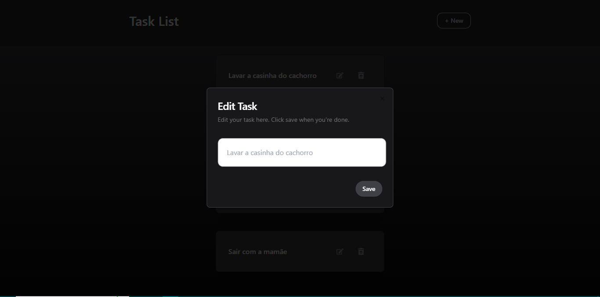

<h1 align="center">
  💻 Todo List
</h1>

  
    
  
  
  
  
  
  
 

  
  
  

 

## 📃 Sobre o projeto

Aplicação de listagem de tarefas

 

## 🚀 Funcionalidades
- Adicionar nova tarefa.
- Remover uma tarefa.
- Editar tarefa existente.
- Armazenamento em banco de dados Postgres.

 

## 🛠 Tecnologias utilizadas
-  React
-  Docker com Postgres
- Shadcnui
- Prisma
- Tailwind
- Node.js

 

<h2> 💻 Autor</h2>

 
  
 <b>Ana Paula</b>

Feito por Ana paula 👋🏽 
